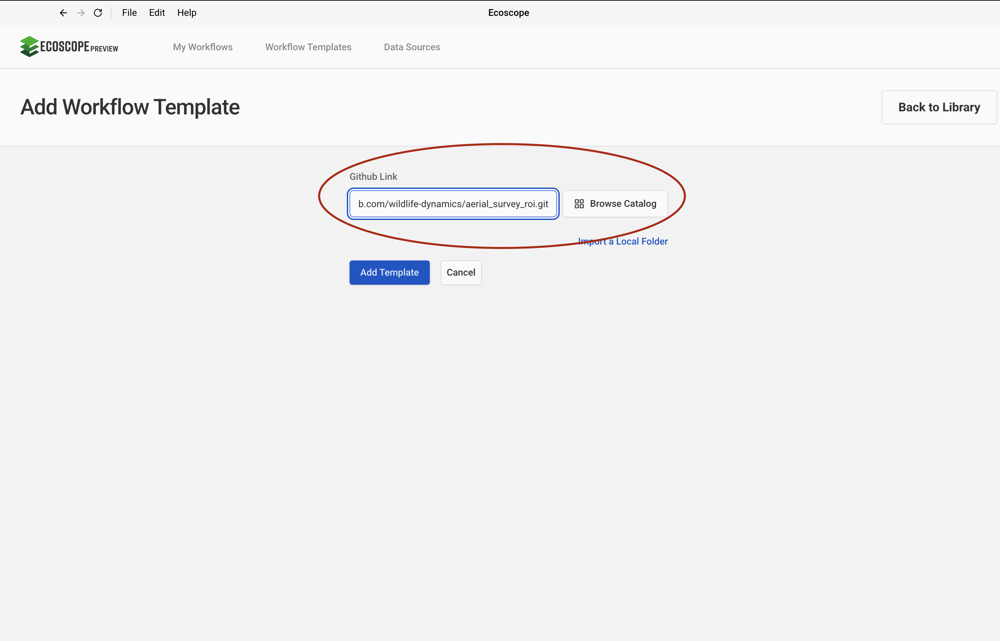
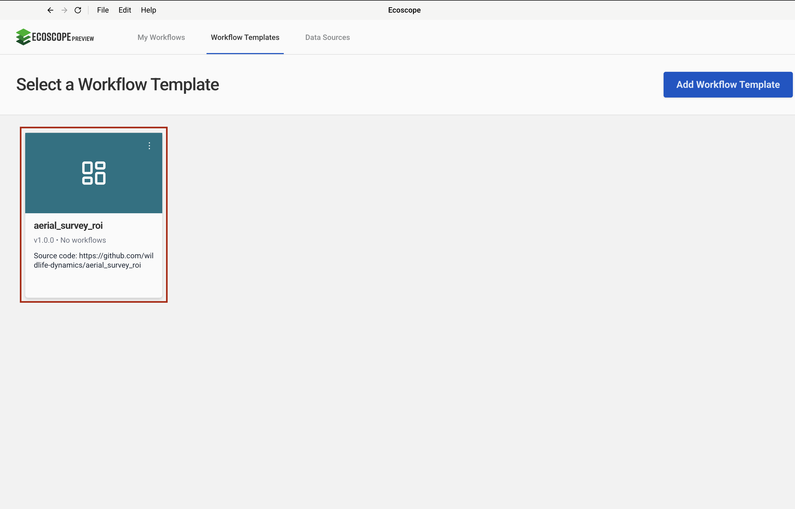
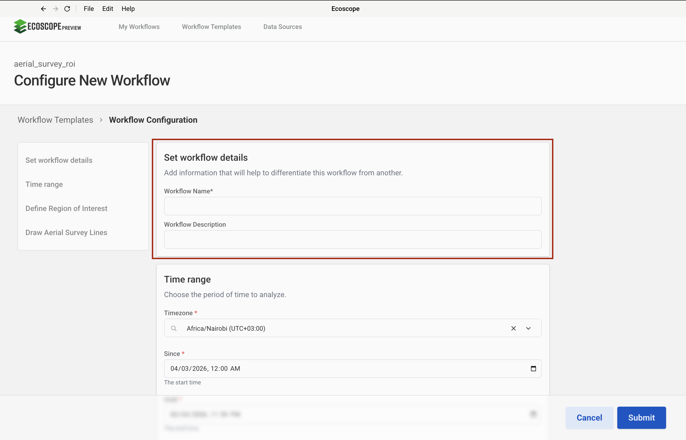
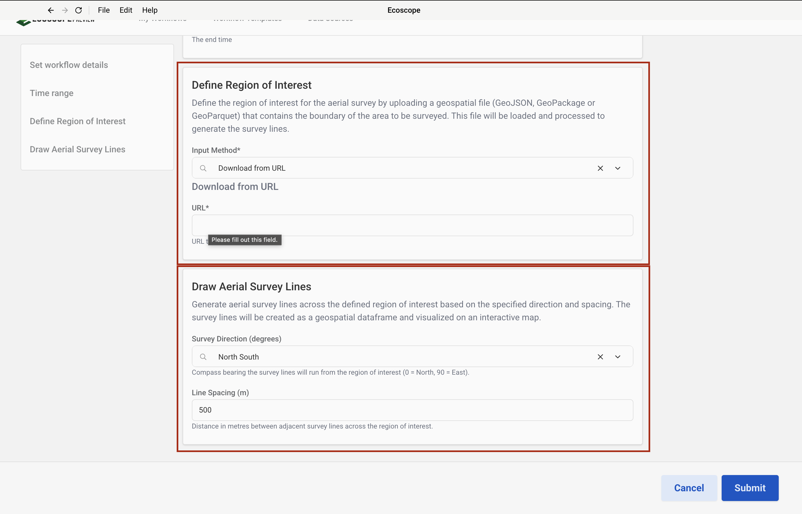

# User Guide: Aerial Survey ROI Workflow

## Overview

This workflow generates aerial survey transect lines over a user-defined Region of Interest (ROI). It takes a geospatial boundary file as input and outputs:

- An interactive HTML ecomap showing the survey lines overlaid on the ROI
- The survey lines exported as a GeoPackage (`.gpkg`)
- The survey lines exported as a GeoParquet (`.geoparquet`)
- A dashboard widget displaying the map

> **Note:** This workflow only supports **polygon** geometry. Point and line geometry types are not supported.

---

## Step-by-Step Instructions

### Step 1 — Add the Workflow Template

Navigate to **Workflow Templates** in the top navigation bar and click **Add Workflow Template**.

In the **Github Link** field, paste the following URL and click **Add Template**:

```
https://github.com/wildlife-dynamics/aerial_survey_roi.git
```



---

### Step 2 — Select the Workflow to Configure

After the template is added, you will see it listed under **Workflow Templates** as `aerial_survey_roi`. Click on the card to open and configure it.



---

### Step 3 — Configure Workflow Details

The **Configure New Workflow** page has a left-side navigation panel with four sections. Start at the top:

#### Set Workflow Details

Provide a name and optional description to identify this workflow run. This label will appear in the output dashboard.

- **Workflow Name** *(required)*: e.g., `Mara North Conservancy Aerial Survey`
- **Workflow Description** *(optional)*: A short description of the survey run

#### Time Range

Select the timezone and the start/end time for the analysis period.

- **Timezone**: e.g., `Africa/Nairobi (UTC+03:00)`
- **Since** / **Until**: Set the date and time window to analyze



---

### Step 4 — Define ROI and Draw Aerial Survey Lines

Scroll down or click the remaining sections in the left panel to complete the configuration.

#### Define Region of Interest

Upload or link to the boundary file for the area to be surveyed.

> **Important:** The input file must contain **polygon** geometry. Point or line files will not work.

| Input Method | Example |
|---|---|
| Download from URL | `https://www.dropbox.com/scl/fi/14rcy4lkwp7xgewj3xf7k/mnc_conservancy.gpkg?...&dl=0` |
| Local path | `/data/inputs/my_conservancy.gpkg` |

- **Input Method**: Select `Download from URL` or upload a local file
- **URL** *(if downloading)*: Paste the direct URL to your `.gpkg`, `.shp`, or `.geojson` file

#### Draw Aerial Survey Lines

Configure how the transect lines are generated across the ROI.

| Parameter | Description | Example |
|---|---|---|
| **Survey Direction (Degrees)** | Compass bearing / orientation of transects | `North South` (0°) or `East West` (90°) |
| **Line Spacing (m)** | Distance in metres between adjacent survey lines | `500` |

The transect lines are automatically clipped to the ROI polygon boundary.



Click **Submit** to run the workflow.

---

## Outputs

Once the workflow completes successfully, the following files are written to `$ECOSCOPE_WORKFLOWS_RESULTS`:

| File | Format | Description |
|---|---|---|
| `aerial_survey.gpkg` | GeoPackage | Survey transect lines, ready for use in QGIS or ArcGIS |
| `aerial_survey.geoparquet` | GeoParquet | Survey transect lines in cloud-native format |
| `aerial_survey.html` | HTML | Interactive ecomap with ROI boundary and survey lines |

The dashboard will display a single map widget titled **"Aerial Survey Lines"** showing:
- The ROI boundary (olive green fill, 15% opacity)
- The generated survey transects (yellow lines)

---

## Troubleshooting

| Issue | Likely Cause | Fix |
|---|---|---|
| Workflow fails on ROI input | Input file contains non-polygon geometry | Ensure your file contains only polygon features |
| No lines generated | ROI too small relative to line spacing | Reduce the **Line Spacing** value |
| URL field validation error | URL is not a direct download link | Use a direct file URL (not a preview link) |
