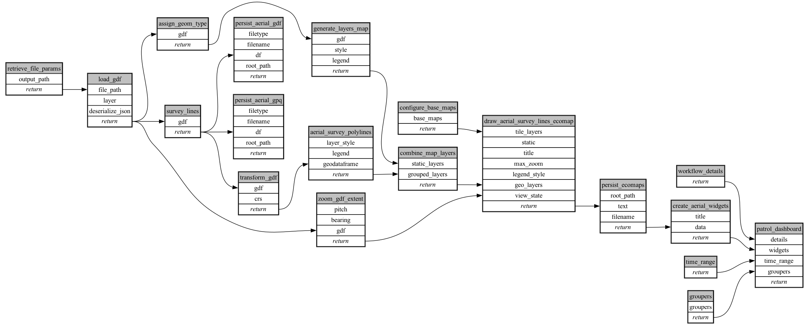

```
# AUTOGENERATED BY ECOSCOPE-WORKFLOWS; see fingerprint in README.md for details

```

```yaml
# fingerprint:
artifacts_sha256_basic: 5052474e5ab601867d20fcda409643f771c9576704073236c868c1d6d050b2ef
artifacts_sha256_strict: 272422aac702b7fa367d8644e8340a8ff844d885626c9250084d1db482b9fed4
installed_requirements:
- channel: https://repo.prefix.dev/ecoscope-workflows/
  name: ecoscope-workflows-core
  version: {version: ==0.22.17}
- channel: https://repo.prefix.dev/ecoscope-workflows/
  name: ecoscope-workflows-ext-ecoscope
  version: {version: ==0.22.17}
- channel: https://repo.prefix.dev/ecoscope-workflows-custom/
  name: ecoscope-workflows-ext-custom
  version: {version: ==0.0.39}
- channel: https://repo.prefix.dev/ecoscope-workflows-custom/
  name: ecoscope-workflows-ext-ste
  version: {version: ==0.0.18}
params_sha256: b410554b68597c4719ff35093709806115466babeb44747714e6a30d39df14b5
spec_sha256: 5a1c0a5e90a71c95e58a515cf8115cbc42f280ba339cda571159a694502e11f7

```

# ecoscope-workflows-aerial-survey-roi-workflow


